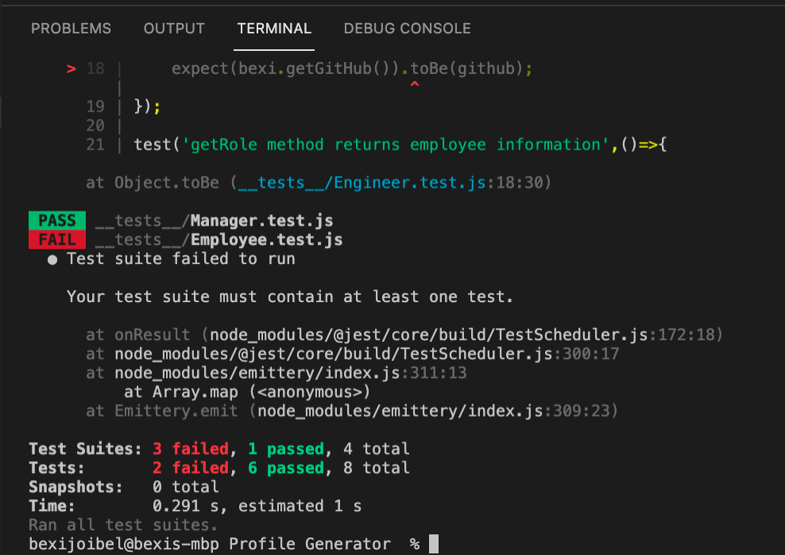
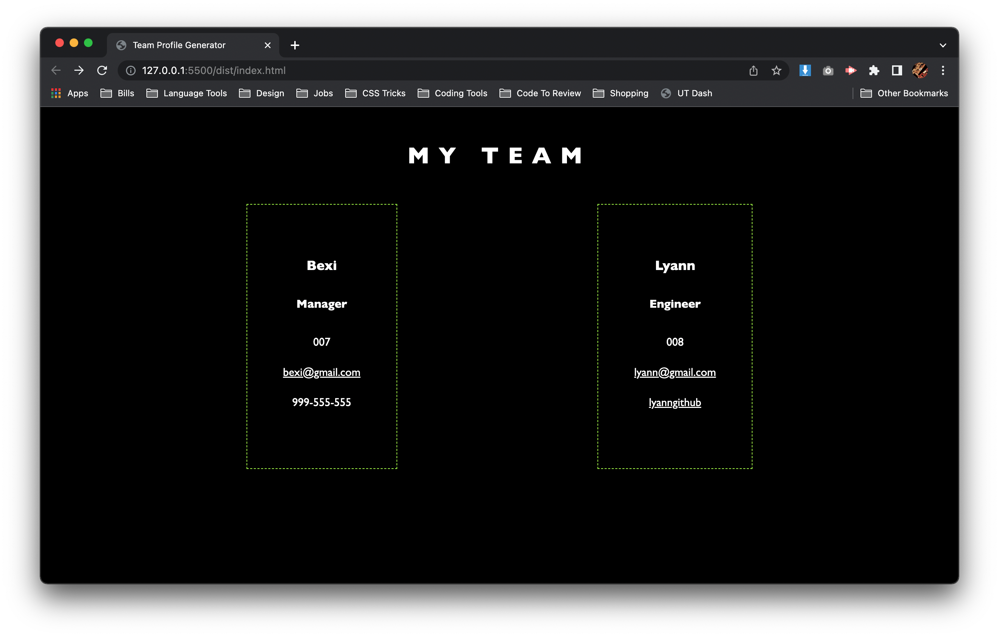

# Profile Generator
# Description
This project uses command-line application to generate an HTML file for user containing user-inputted team member information. When the user inputs their responces the logic will automatically auto populated a pre-determined template coded within the javascript file. Once the file has been created. If the user runs the comman-line application again, the readME will automatically override with new information. 
## Table of Table of Contents Read Me
*[Installation](#installation)\
*[Usage](#usage)\
*[Credits](#credits)\
*[License](#license)
## Installation 
We are installing this application via the command-line using node.js and npm and jest unit test.
## Usage
At this moment you are able to use this command line application to generate different team profiles
## Contributing
At this time, this project/generator is open source. 
## Tests
You are able to test this project by downloading the started code and using the terminal within your code editor.

## Question
If you have any questions, please feel free to reach out via:\
GitHub: https://github.com/thechicketarian/\
Email: thechicketarian@gmail.com
## Bugs 
At this moment the application is not 100% running as it should. Currently I am troubleshooting, adding more than 2 team members and trying to debug why my tests are not fully syncing. These are issues as of 5/21/22. I will be continuing to work on this application until everything is working correctly.\

## Demo Video & Screenshot
\
[View Demo Video](
<iframe src="https://player.vimeo.com/video/712465243?h=6c52af1236&amp;badge=0&amp;autopause=0&amp;player_id=0&amp;app_id=58479" frameborder="0" allow="autoplay; fullscreen; picture-in-picture" allowfullscreen style="position:absolute;top:0;left:0;width:100%;height:100%;" title="profile.generator-DEMO.mov"></iframe>
)